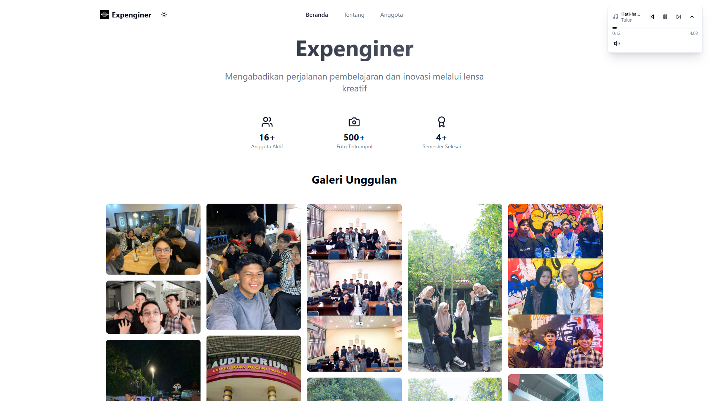

<div align="right">


</div>

# Expengineer



A modern React application built with Vite, TypeScript, and Tailwind CSS.

## Features

- React 18 with TypeScript
- Vite for fast development and building
- Tailwind CSS for styling
- Radix UI components
- React Router for navigation
- Theme support (light/dark mode)
- Responsive design

## Getting Started

### Prerequisites

- Node.js 18+ or Bun
- Git

### Installation

1. Clone the repository:
```bash
git clone <your-repo-url>
cd Expengineer
```

2. Install dependencies:
```bash
bun install
# or
npm install
```

3. Start the development server:
```bash
bun run dev
# or
npm run dev
```

The application will be available at `http://localhost:8080`

## Building for Production

```bash
bun run build
# or
npm run build
```

## Deployment

### Vercel Deployment

This project is configured for easy deployment on Vercel:

1. Push your code to GitHub
2. Connect your repository to Vercel
3. Vercel will automatically detect the configuration and deploy

The deployment is configured with:
- Build command: `bun run build`
- Output directory: `dist`
- Framework: Vite
- SPA routing support

### Manual Deployment

1. Build the project:
```bash
bun run build
```

2. The `dist` folder contains the production build
3. Upload the contents of `dist` to your web server

## Project Structure

```
src/
├── components/     # Reusable components
├── hooks/         # Custom React hooks
├── lib/           # Utility functions
├── pages/         # Page components
├── App.tsx        # Main app component
└── main.tsx       # Entry point
```

## Environment Variables

Create `.env.local` for local development:
```
VITE_APP_TITLE=Expengineer
```

## Technologies Used

- React 18
- TypeScript
- Vite
- Tailwind CSS
- Radix UI
- React Router
- React Query
- Bun

## License

See LICENSE file for details.
